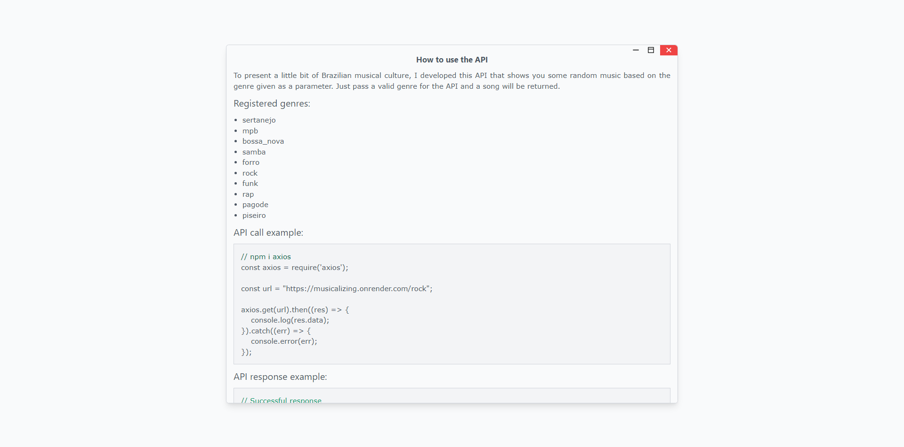

## Musicalizing

**Accessible project link: <a href="">Musicalizing</a>**

## Summary:

1. [What it is](#what-it-is)
2. [Running the application locally](#running-the-application-locally)
3. [Folders](#folders)
4. [Preview](#preview)

## What it is :

API developed to show a little of Brazilian musical culture, providing random music based on a genre passed as a parameter. Main API page developed in <a href="https://tailwindcss.com/">Tailwind CSS</a>.

### Technologies and libraries used :

- Node.js
- MongoDB
- Express
- handlebars
- mongoose
- HTML, CSS, JavaScript
- Tailwind CSS

### Consuming the API :

**All necessary documentation is available on the application's <a href="">main</a> page**


## Folders:

- **/src/config:** Defines project settings
- **/src/controllers:** Defines the request handling functions
- **/src/models:** Defines models for storage in the Database
- **/src/routes:** Defines API routes
- **/src/services:** Defines specific files for handling the Database
- **/src/views:** Defines the application's view pages
- **/src/public:** Defines the project's static files


## Running the application locally :

1. First, make sure you have <a href="https://nodejs.org/en">Node.js</a> installed on your machine.

   > Program developed in version 18.12.1 on Node.js.

2. Then, you need to create a collection and an object in the database following a structure based on the <a href="./src/models/Songs.js">model</a>, and then insert the data as needed.

3. To run the project, you need to create a file called ".env" in the root directory, paste the lines below into this file and replace the strings with their respective information:

   ```bash
       MONGODB_URI ="<YOUR-MONGODB-DATABASE-URI>"
       SONGS_ID = "<COLLECTION-ID>"
   ```

   > "COLLECTION-ID": Collection where songs are stored by genre.

4. Then run the “start.bat” file in the root directory.

## Preview :

<table width="100%"> 
<tr>
<td width="100%">

</td> 
</tr>
</table>
